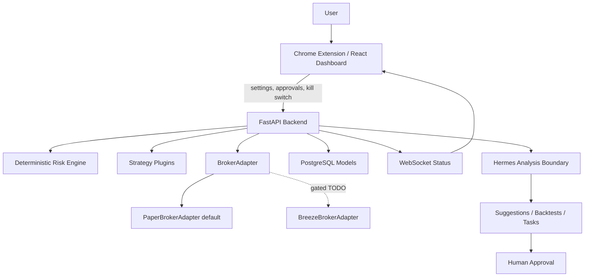

# Architecture

The system is backend-first. The extension controls and observes; it does not trade by browser automation.

## Components

- `extension/`: React, TypeScript, Tailwind, Manifest V3 dashboard.
- `backend/app/api/routes/`: FastAPI route modules.
- `backend/app/broker/`: `BrokerAdapter`, paper adapter, and safe Breeze placeholder.
- `backend/app/risk/`: deterministic rules and risk engine.
- `backend/app/strategies/`: plugin interface and initial strategy scaffolds.
- `backend/app/execution/`: order, position, and square-off services.
- `backend/app/reporting/`: EOD report and metrics.
- `backend/app/hermes/`: suggestion-only analysis boundary.
- `backend/app/withdrawal/`: read-only readiness and manual checklist.
- `backend/app/db/models.py`: PostgreSQL schema models.

## Safety Boundary

Hermes and the extension never receive broker credentials or order-placement authority. Only the backend broker adapter can place broker actions, and live Breeze calls are disabled until explicitly implemented behind hard guardrails.
