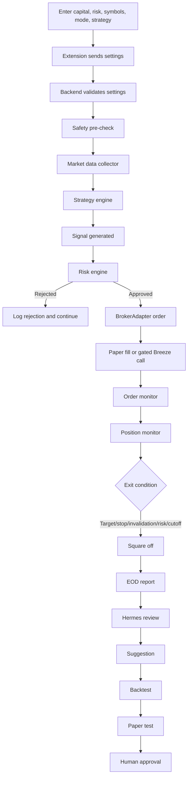

# System Flow

## Phase Order

1. Scaffold backend, extension, schema, settings, health, WebSocket.
2. Paper trading with risk engine, strategies, logs, reports, emergency stop.
3. Backtesting and strategy comparison.
4. Breeze read-only and then live integration behind safety flags.
5. Hermes suggestions and offline testing workflow.
6. Live guardrails with tiny capital, manual confirmation, and monitoring.
7. Dashboard polish and operational guides.

The current scaffold implements the first two phases enough to develop and test locally, with placeholders for later phases.
